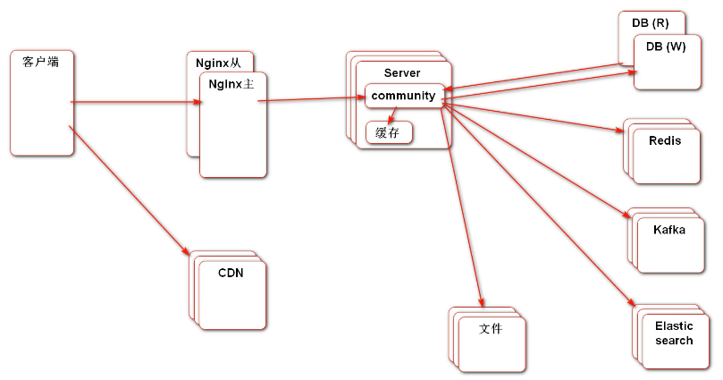
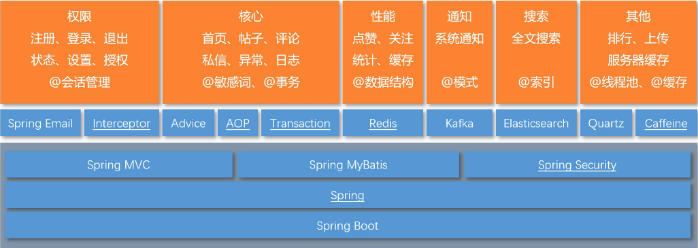

# community
一个基于Spring MVC的论坛

偶然翻到此项目，感觉不错，后续学习过程验证此项目确实很好。

[项目总结](#项目总结) | [技术架构](#技术架构) | [开发环境](#开发环境) | [项目总结](#项目总结) | [安装教程](#安装教程) | [参考资料](#参考资料)

## 项目总结

一个仿牛客网实现的讨论社区，不仅实现了基本的注册，登录，发帖，评论，点赞，回复功能，同时使用前缀树实现敏感词过滤，使用wkhtmltopdf生成长图和pdf，实现了网站UV和DAU统计，并将用户头像等信息存于七牛云服务器。

## 技术架构

- Spring Boot 2.6.6
- Spring 、Spring MVC、MyBatis 2.2.0
- Redis 3.2.100、Kafka 2.13-3.1.0、Elasticsearch 7.15.2、caffeine 2.8.8
- Spring Security、Spring Actuator

## 开发环境

- 构建工具：Apache Maven 3.6.3
- 集成开发工具：IDEA 2020.1
- 数据库：MySQL 8.0.23、Redis 3.2.100、qiniu 7.8.0
- 应用服务器：Apache Tomcat
- 版本控制工具：Git 2.35.1.2

## 项目总结

- 使用Spring Security 做权限控制，替代拦截器的拦截控制，并使用自己的认证方案替代Security 认证流程，使权限认证和控制更加方便灵活。
- 使用Redis的set实现点赞，zset实现关注，并使用Redis存储登录ticket和验证码，解决分布式session问题。
- 使用Redis高级数据类型HyperLogLog统计UV(Unique Visitor),使用Bitmap统计DAU(Daily Active User)。
- 使用Kafka处理发送评论、点赞和关注等系统通知，并使用事件进行封装，构建了强大的异步消息系统。
- 使用Elasticsearch做全局搜索，并通过事件封装，增加关键词高亮显示等功能。
- 对热帖排行模块，使用分布式缓存Redis和本地缓存Caffeine作为多级缓存，避免了缓存雪崩，将QPS提升了20倍(10-200)，大大提升了网站访问速度。并使用Quartz定时更新热帖排行。
- 使用 `Jasypt` 实现配置文件敏感信息加密。

## 安装教程

建议使用和项目版本一致的软件，jdk = 1.8

1.拉取项目

2.启动redis，kafka，elasticsearch

3.启动项目，访问http

## 参考资料

[https://github.com/cosen1024/community](https://github.com/cosen1024/community)
[https://github.com/lyh2048/nowcoder-community](https://github.com/lyh2048/nowcoder-community)

